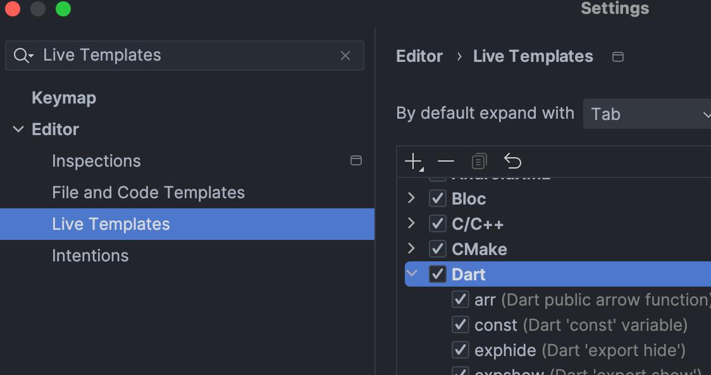

### How to use templates:
1. Go to Settings -> Live Templates -> Dart



2. Copy and paste next templates into `Dart`

Flutter BLoC - `frzbloc`
```xml
<template name="frzbloc" value="import 'package:bloc/bloc.dart';&#10;import 'package:freezed_annotation/freezed_annotation.dart';&#10;&#10;part '$class_name$_bloc.freezed.dart';&#10;part '$class_name$_event.dart';&#10;part '$class_name$_state.dart';&#10;&#10;final class $ClassName$Bloc extends Bloc&lt;$ClassName$Event, $ClassName$State&gt; {&#10;  $ClassName$Bloc() : super(const $ClassName$State.idle()) {&#10;    on&lt;_$ClassName$Started&gt;(_start);&#10;  }&#10;&#10;  void _start(_$ClassName$Started event, Emitter&lt;$ClassName$State&gt; emitter) {}&#10;}" description="Freezed BLoC" toReformat="true" toShortenFQNames="true">
  <variable name="ClassName" expression="" defaultValue="" alwaysStopAt="true" />
  <variable name="class_name" expression="snakeCase(ClassName)" defaultValue="" alwaysStopAt="true" />
  <context>
    <option name="DART_TOPLEVEL" value="true" />
  </context>
</template>
```

Flutter BLoC Event - `frzevent`
```xml
<template name="frzevent" value="part of '$class_name$_bloc.dart';&#10;&#10;@Freezed(copyWith: false)&#10;sealed class $ClassName$Event with _$$$ClassName$Event {&#10;  const factory $ClassName$Event.start() = _$ClassName$Started;&#10;}" description="Freezed BLoC event" toReformat="true" toShortenFQNames="true">
  <variable name="ClassName" expression="" defaultValue="" alwaysStopAt="true" />
  <variable name="class_name" expression="snakeCase(ClassName)" defaultValue="" alwaysStopAt="true" />
  <context>
    <option name="DART_TOPLEVEL" value="true" />
  </context>
</template>
```

Flutter BLoC State - `frzstate`
```xml
<template name="frzstate" value="part of '$class_name$_bloc.dart';&#10;&#10;@Freezed()&#10;sealed class $ClassName$State with _$$$ClassName$State {&#10;  const $ClassName$State._();&#10;&#10;  const factory $ClassName$State.idle() = $ClassName$Idle;&#10;&#10;  const factory $ClassName$State.processing() = $ClassName$Processing;&#10;&#10;  const factory $ClassName$State.success() = $ClassName$Success;&#10;&#10;  const factory $ClassName$State.failure() = $ClassName$Failure;&#10;}" description="Freezed BLoC state" toReformat="true" toShortenFQNames="true">
  <variable name="ClassName" expression="" defaultValue="" alwaysStopAt="true" />
  <variable name="class_name" expression="snakeCase(ClassName)" defaultValue="" alwaysStopAt="true" />
  <context>
    <option name="DART_TOPLEVEL" value="true" />
  </context>
</template>
```

json_serializable DTO - `jsondto`
```xml
<template name="jsondto" value="import 'package:json_annotation/json_annotation.dart';&#10;&#10;part '$class_name$.g.dart';&#10;&#10;@JsonSerializable()&#10;class $ClassName$ {&#10;  const $ClassName$({&#10;    required this.value,&#10;  });&#10;&#10;  factory $ClassName$.fromJson(Map&lt;String, Object?&gt; json) =&gt;&#10;      _$$$ClassName$FromJson(json);&#10;&#10;  final String? value;&#10;&#10;  Map&lt;String, Object?&gt; toJson() =&gt; _$$$ClassName$ToJson(this);&#10;}&#10;" description="json_seizalizable DTO" toReformat="true" toShortenFQNames="true">
  <variable name="ClassName" expression="" defaultValue="" alwaysStopAt="true" />
  <variable name="class_name" expression="snakeCase(ClassName)" defaultValue="" alwaysStopAt="true" />
  <context>
    <option name="DART_TOPLEVEL" value="true" />
  </context>
</template>
```
